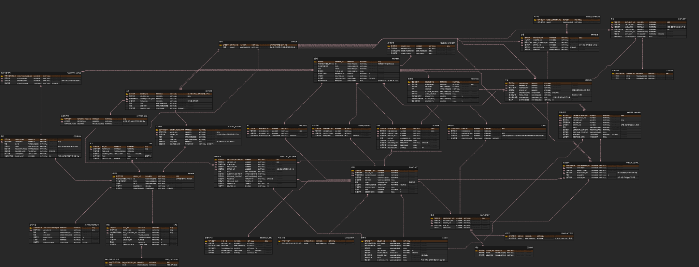
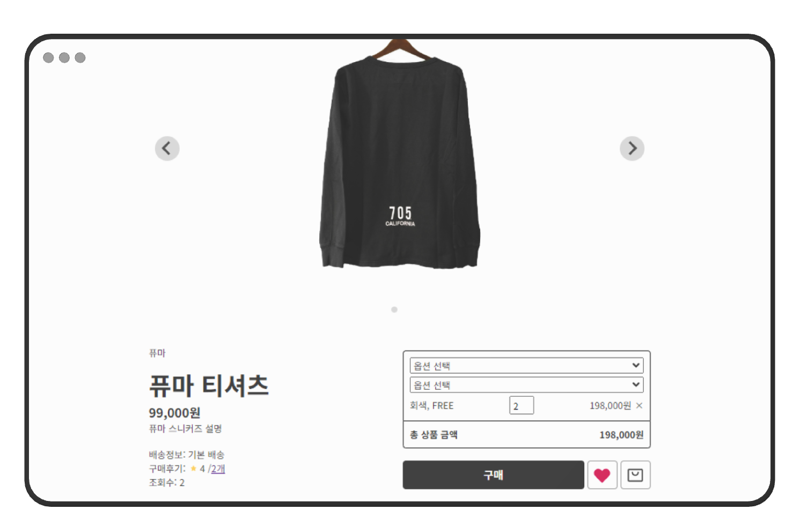
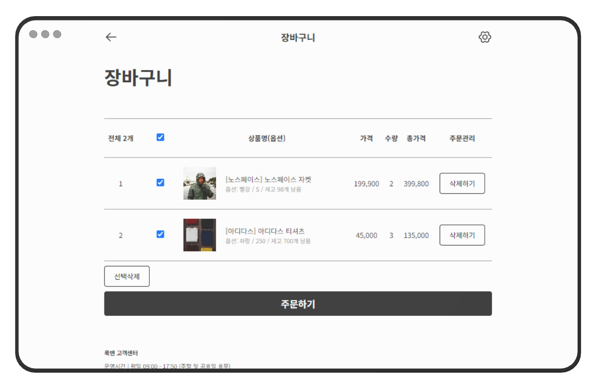
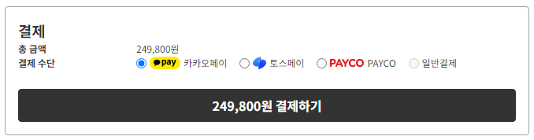
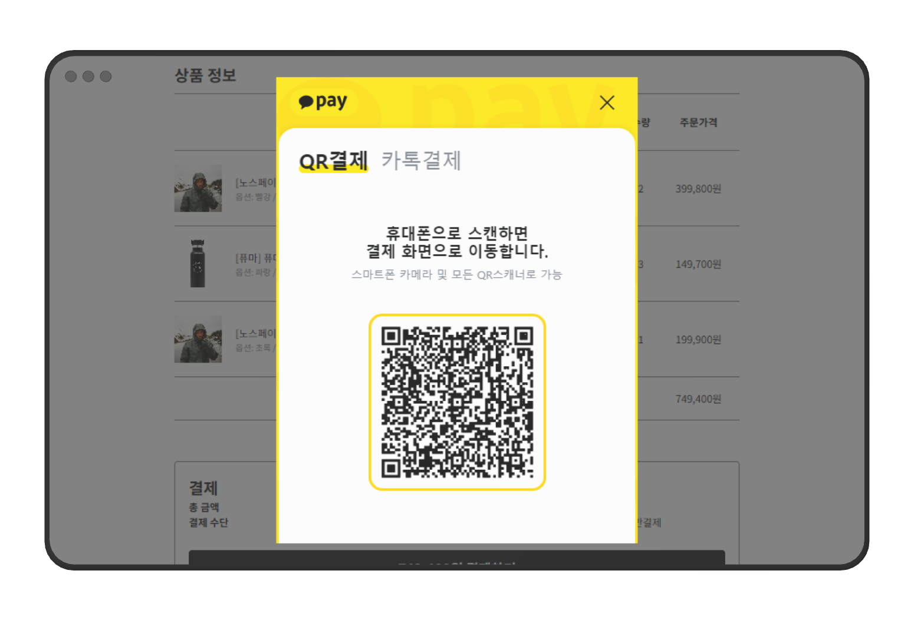
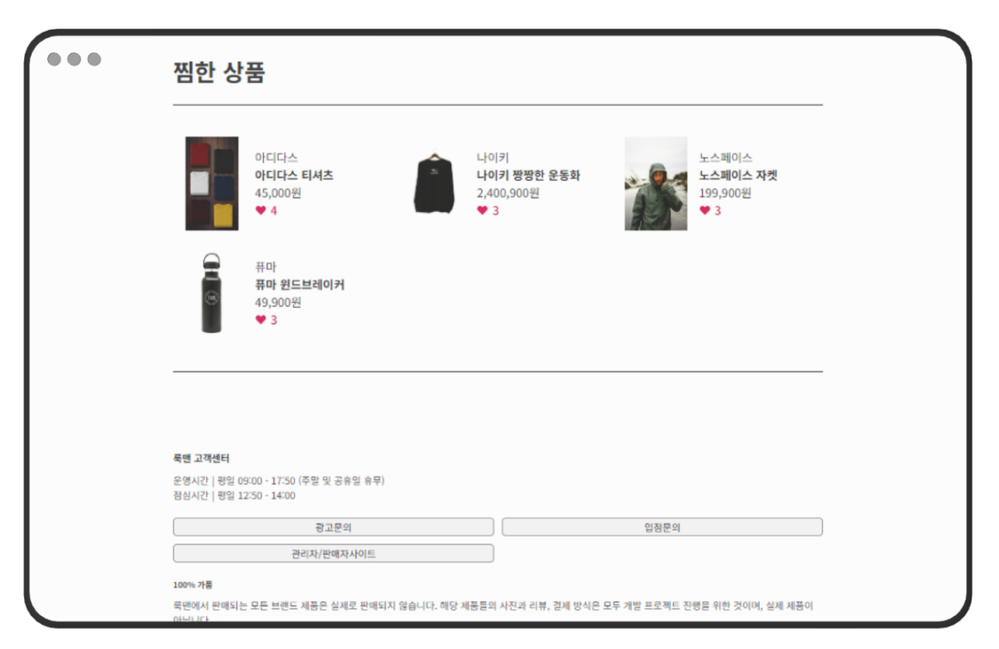
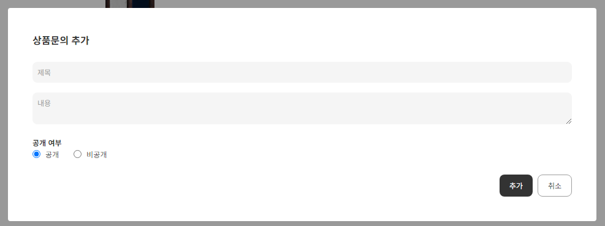
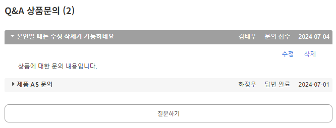
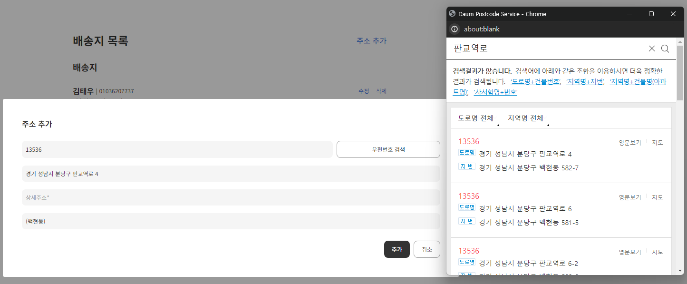

# LOOKMAN - 남성 의류 쇼핑몰 프로젝트

> LOOKMAN은 사용자 친화적인 인터페이스와 다양한 기능을 제공하는 남성 의류 전문 쇼핑몰 프로젝트입니다.

## 목차

- [프로젝트 개요](#프로젝트-개요)
- [프로젝트 목표](#프로젝트-목표)
- [팀 구성원](#lookman팀-구성원)
- [기술 스택](#기술-스택)
- [주요 기능](#주요-기능)
- [구현 내용](#주요-구현-내용)
- [설치 방법](#설치-및-실행-방법)
- [기여 방법](#기여-방법)

## 프로젝트 개요

- 프로젝트명: LOOKMAN (남성 의류 쇼핑몰)
- 개발 기간: 2024.04.29 ~ 2024.06.05

## 프로젝트 목표

1. CRUD 작업 및 데이터베이스 관리 친숙도 향상
2. 쇼핑몰이 가지고 있는 여러 Entity 간의 관계 구현
3. 데이터베이스 설계 및 활용 능력을 배양하는 포괄적인 학습 경험

## LOOKMAN팀 구성원

|                           프로필                           |  이름  | 역할                                              |                    GitHub                     |
| :--------------------------------------------------------: | :----: | :------------------------------------------------ | :-------------------------------------------: |
|  | 김태우 | - 회원, 비회원 기능/화면 구현 - 조장, DB관리자 | [taewookim02](https://github.com/taewookim02) |
|   | 이용진 | - 판매자, 관리자 기능/화면 구현 - 형상관리자   |  [dydwls6960](https://github.com/dydwls6960)  |

## 기술 스택

- 운영체제: Windows 10
- 개발 언어: Java (JDK 17), HTML/CSS, JavaScript
- 프레임워크/라이브러리: MyBatis 3.5.16, jQuery, vex, gson, jstl, iamport, KakaoPay
- 데이터베이스: Oracle XE 21c
- 개발 도구: Eclipse, VSCode, Postman
- WAS: Apache Tomcat 9.0
- 협업 도구: Git, GitHub, SourceTree, ERDCloud

## 주요 기능

|         비회원         |      회원       |     판매자     |    관리자     |
| :--------------------: | :-------------: | :------------: | :-----------: |
|        회원가입        |    주문 결제    |   상품 관리    |   회원 관리   |
|     상품 조회/검색     | 주문/상품 문의  | 문의/후기 관리 |   주문 관리   |
| 카테고리/브랜드별 조회 |    리뷰 작성    | 판매 내역 관리 |  판매자 관리  |
|                        | 장바구니/찜하기 | 주문 상태 관리 |   상품 관리   |
|                        | 회원 정보 관리  |   통계 분석    | 카테고리 관리 |
|                        |   배송지 관리   |                | FAQ/QnA 관리  |
|                        | 로그인/로그아웃 |                |   통계 분석   |

## 향후 구현 예정 기능

- 소셜 로그인
- 광고 및 브랜드 관리
- 회원 제재 및 게시글 신고
- 상품 SNS 공유
- 앱 포인트 및 쿠폰 시스템
- 최근 본 상품 및 체형별 리뷰
- 1:1 실시간 채팅

## 주요 구현 내용

### ERD 설계

- [ERD 링크](https://www.erdcloud.com/d/tKdES5G5DbGN77GDF)

### 상품 상세

- 좋아요 기능 (찜하기)
- 재고 색상별 쿼리 기능 (AJAX)
- 장바구니/구매 기능

### 장바구니

- 단일/여러 아이템 삭제 기능
- 단일/여러 아이템 주문 기능
- 화면 렌더링 기능

### 결제 기능

- 카카오페이, 토스페이, 페이코 결제 연동
- 배송 정보 선택 기능

### 찜한 상품 화면

- 찜한 상품 조회 기능
- 상품 및 판매자 하이퍼링크 기능

### 상품 문의 기능

- 상품문의 조회 기능
- 상품문의 추가 기능

### 배송지 관리 기능

- 배송지 조회, 추가, 수정, 삭제 기능
- 다음 주소 API 연동
- 기본 배송지 지정 기능

## 설치 및 실행 방법

1. git clone
2. Eclipse에서 프로젝트 불러오기 (`/semiWorkspace/prj`)
3. Eclipse Dynamic Web 모듈 4.0으로 설정
4. Tomcat 서버 추가
5. Java JDK 버전 17 설정
6. 라이브러리 의존성 추가 (`/WEB-INF/lib/`)
   - gson-2.10.1.jar
   - jstl-1.2.jar
   - mybatis-3.5.16.jar
   - ojdbc11.jar
7. Oracle SQL 스크립트 실행
   1. `01_CREATE_USER.sql`
   2. `02_DDL.sql`
8. Tomcat 서버 실행
9. 웹 브라우저에서 `http://127.0.0.1:8080/app/home` 접속

## 기여 방법

1. 이 저장소를 포크(Fork)합니다.
2. 새로운 기능 브랜치를 생성합니다 (`git checkout -b feature/AmazingFeature`).
3. 변경 사항을 커밋합니다 (`git commit -m '새로운 기능 추가'`).
4. 브랜치에 푸시합니다 (`git push origin feature/AmazingFeature`).
5. Pull Request를 생성합니다.
